# Project Gallery & Execution Log

## 1. SKYWater130 DAY 1-2
*Understanding the Open-Source ASIC Flow and Standard Cell Design.*

| Image | Description |
| :--- | :--- |
| 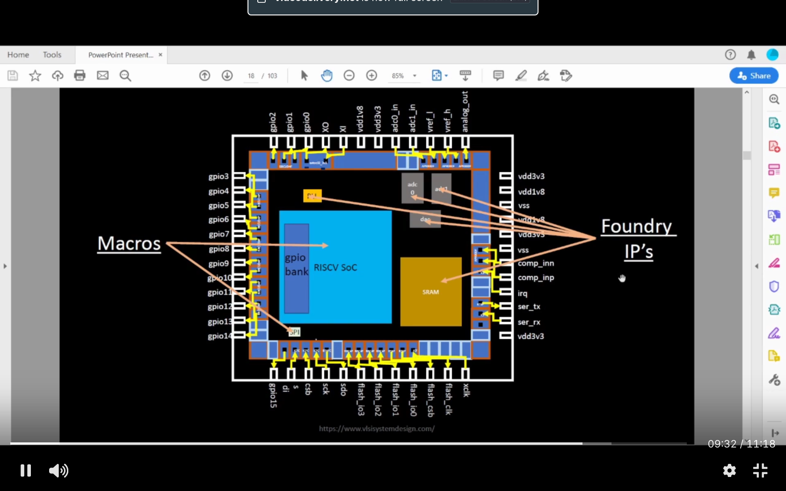 | **Chip Architecture:** Overview of RISC-V SoC, Macros, and Foundry IPs. |
| 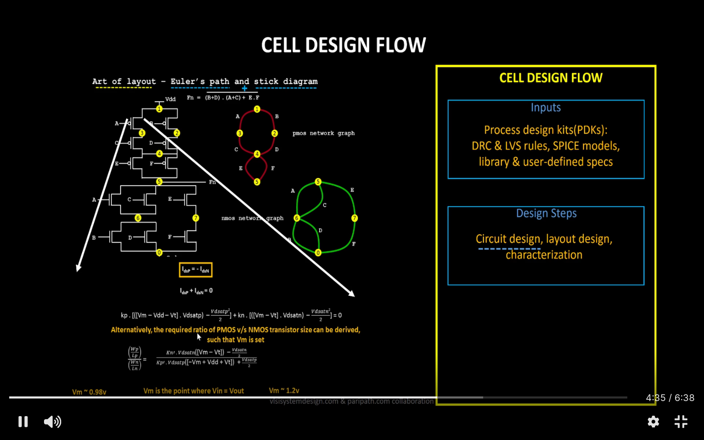 | **Standard Cell Design Flow:** Inputs (PDKs, Rules) and Outputs (CDL, GDSII, LEF). |
| 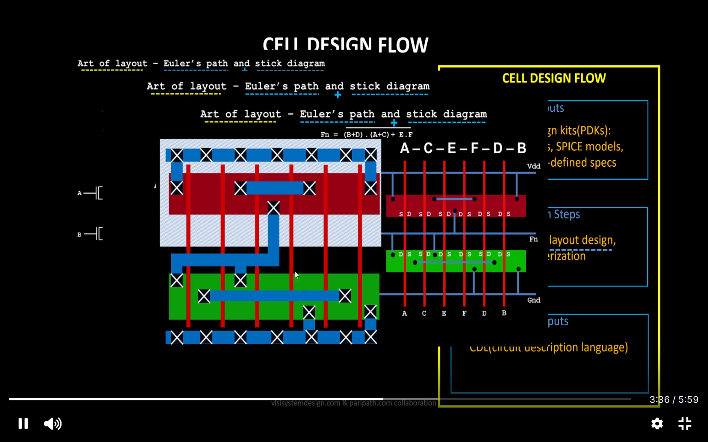 | **Layout Theory:** Using Euler's path for consistent transistor gating. |
| 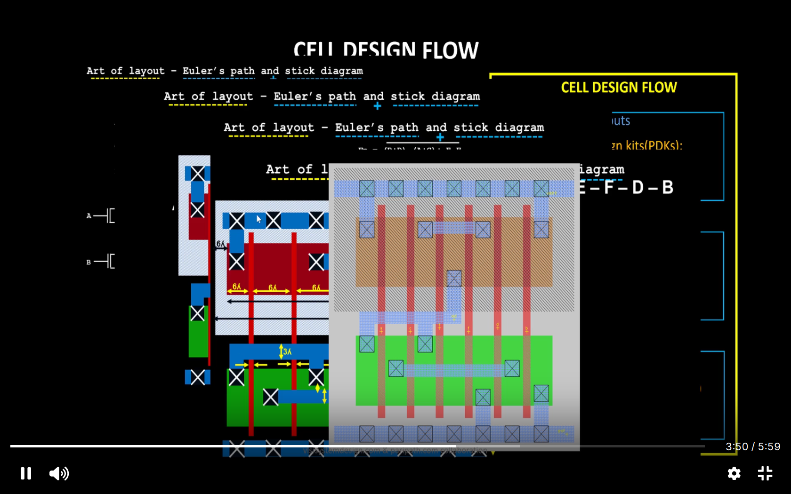 | **Stick Diagram:** Conceptual layout of the CMOS inverter. |

---

## 2. SKYWater130 DAY 3
*Designing the `sky130_vsdinv` cell, analyzing robustness, and extracting parameters.*

| Image | Description |
| :--- | :--- |
| 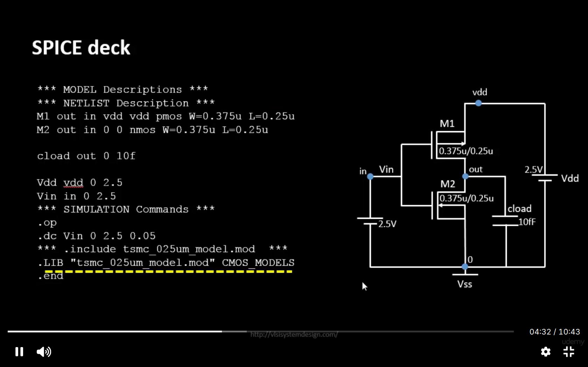 | **SPICE Deck:** Writing the SPICE netlist for the CMOS inverter. |
| 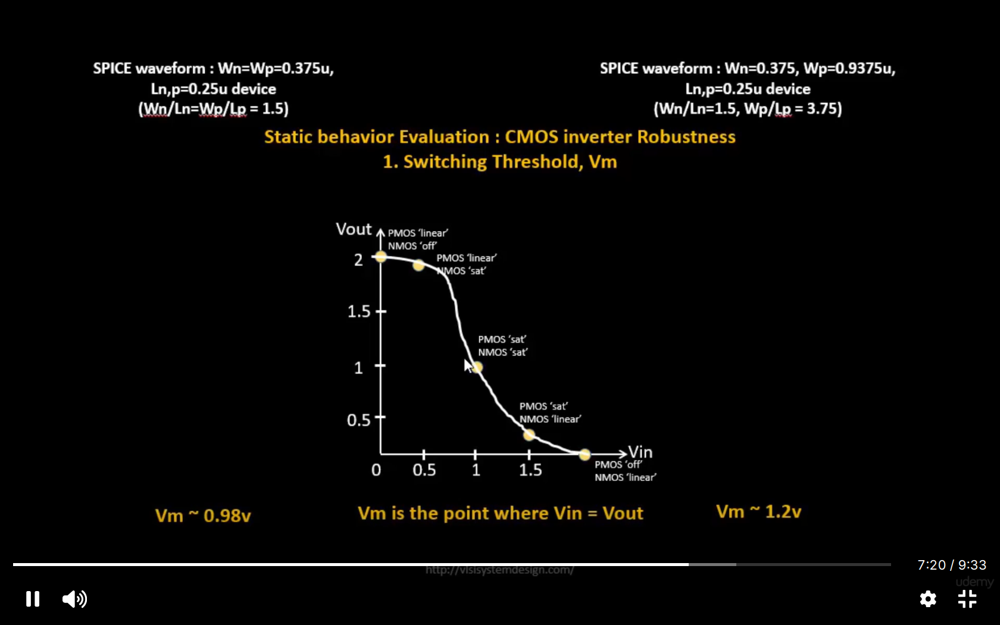 | **Static Analysis:** Plotting the Voltage Transfer Characteristic (VTC). |
| 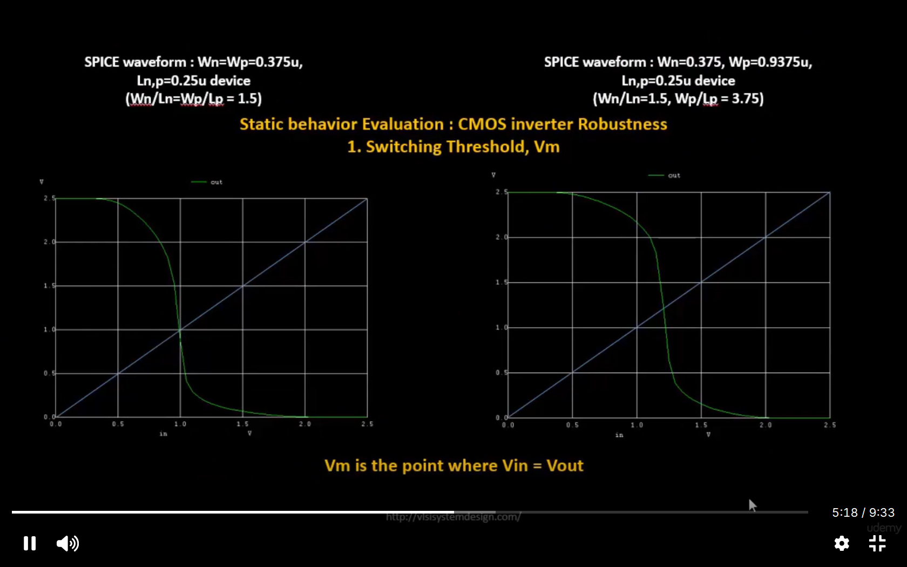 | **Robustness:** Analyzing the switching threshold (Vm) and noise margins. |
| 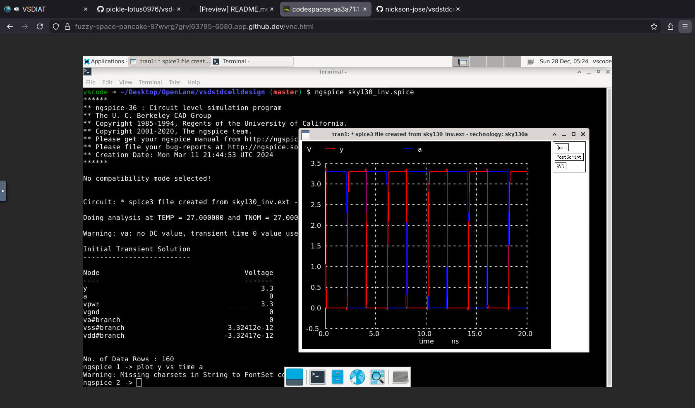 | **Transient Response:** Final Ngspice simulation showing Input (Blue) vs Output (Red). |

---

## 3. Physical Layout (Magic)
*Drawing the layout in Magic VLSI, adhering to Sky130 DRC rules.*

| Image | Description |
| :--- | :--- |
| 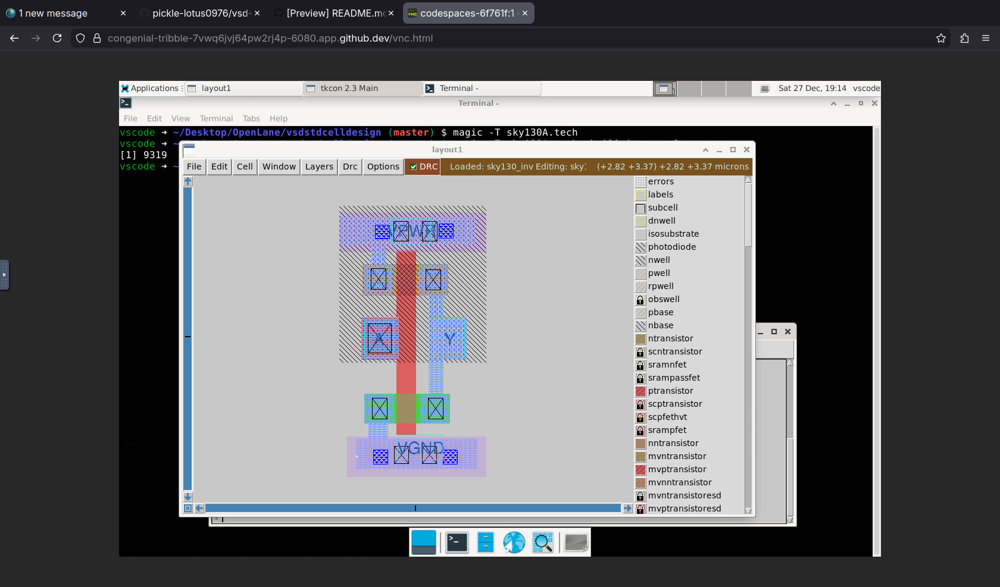 | **Final Layout:** The completed `sky130_vsdinv` layout in Magic. |
| 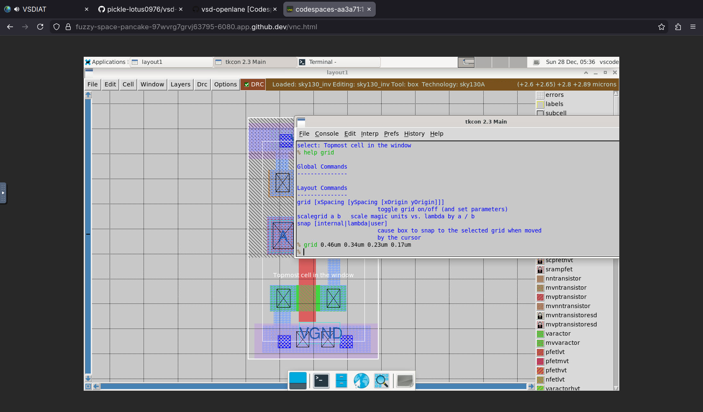 | **Grid Alignment:** Configuring the grid to match the track pitch. |
| 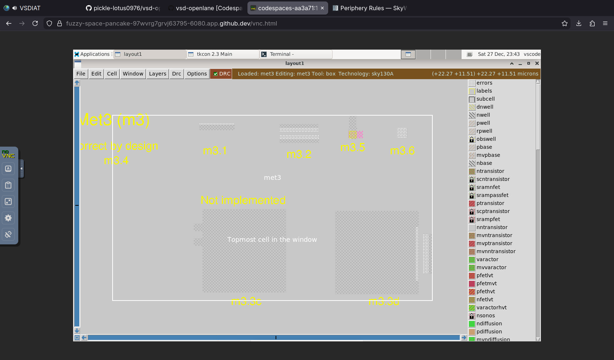 | **DRC Verification:** Checking Metal3 area and spacing rules. (Course Challange) |
| 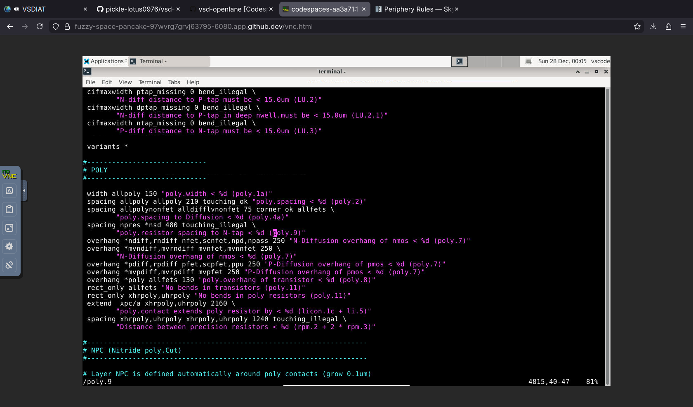 | **DRC Logs:** Analyzing terminal output and fixing issues for poly and diffusion spacing violations. (Course Challange) |

---

## 4. Integration & Debugging Log (Work in Progress)
*Attempting to plug the custom cell into the OpenLANE flow.*

| Image | Description |
| :--- | :--- |
| 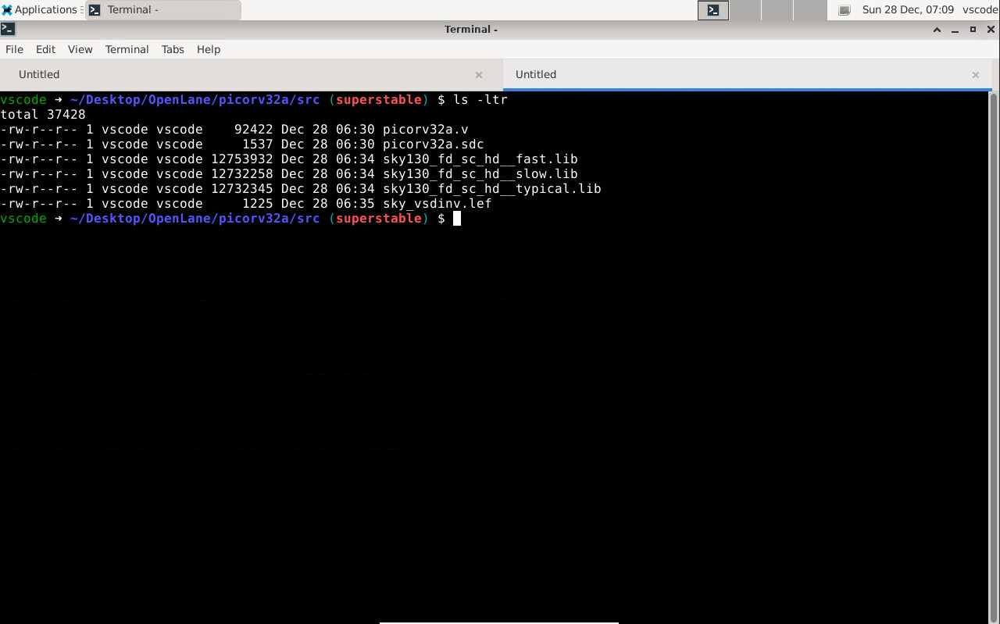 | **File Check:** Verifying `.lef` and `.lib` files are present in the source directory. |
| 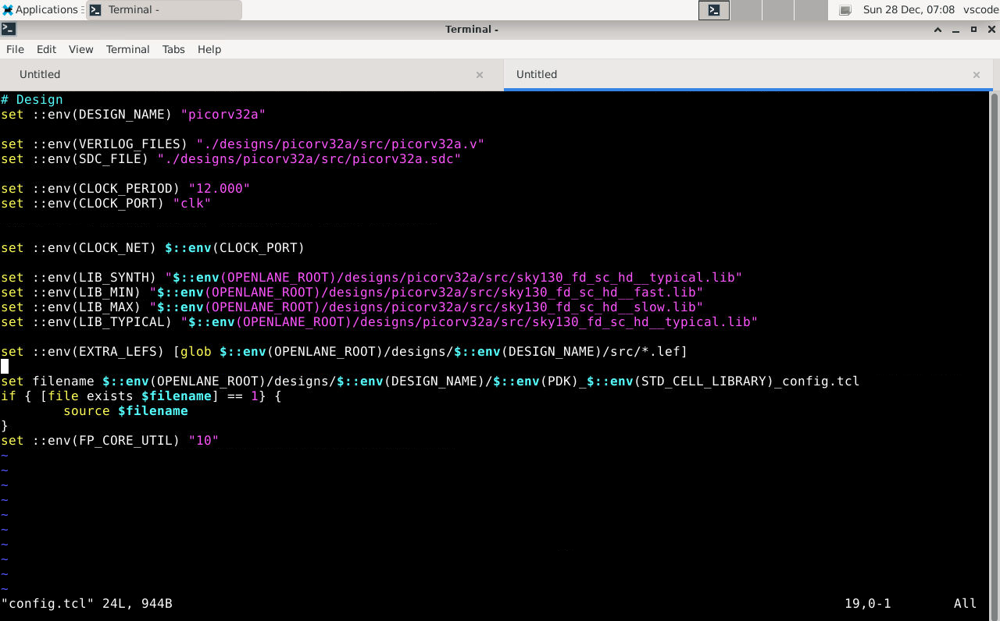 | **Configuration:** Editing `config.tcl` to include `EXTRA_LEFS` and `LIB_SYNTH`. |
| 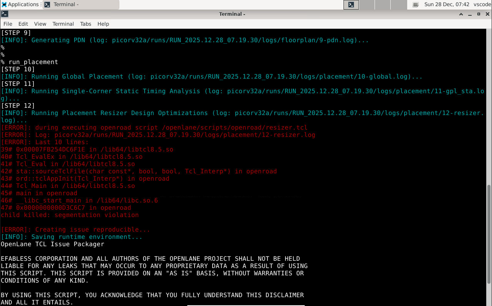 | **Current Blocker:** OpenLANE encountering a segmentation fault during the Placement Resizer step. |
| 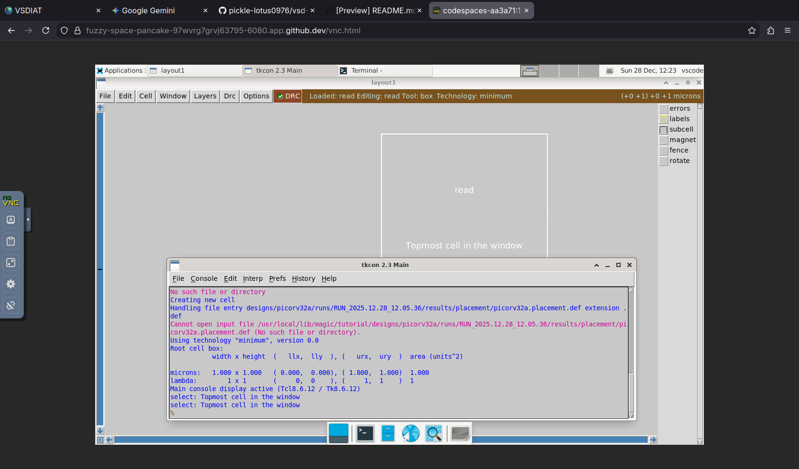 | **Debugging:** Attempting to manually load the placement DEF to investigate the failure. |
